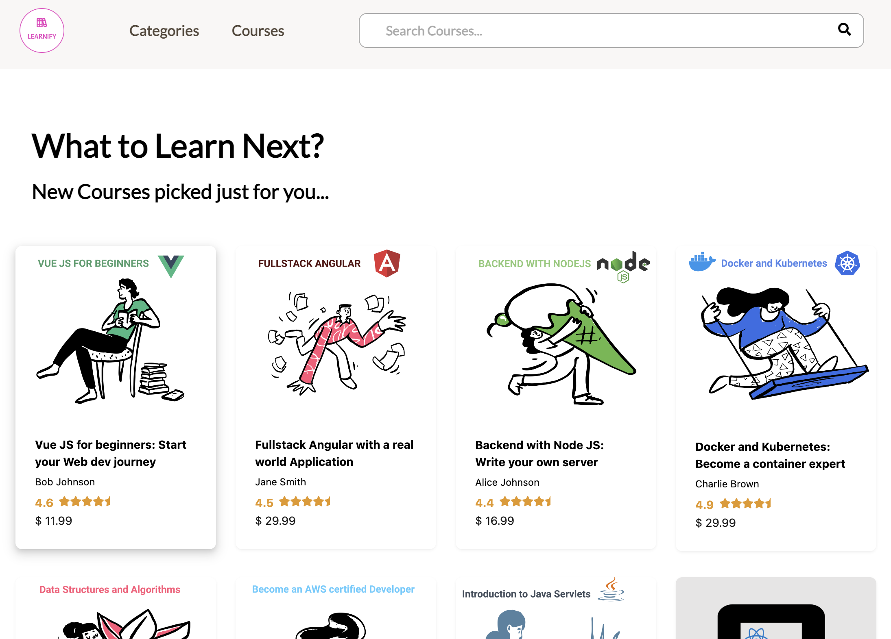

<h2 align="center">
 
Learnify Fullstack E-learning Platform

</h2>

<h3 align="center">React/Redux-Toolkit/Typescript/SqlLite/Stripe/.NET Core</h3>

   

 

## Frontend Routes:

- **Home screen**: Navigation bar, fetching courses, search, filtering, sorting and pagination.
- **Course description screen**: Information about the course such as learnings, requirements, description and the ability to Add to Cart and Book Now.
- **Shopping cart screen**: Using redux toolkit to store course details and user's details including the courses in their cart. When a user clicks on the cart icon, they're redirected to the basket page.
- **Login screen**: Using identity framework to take care of all the requirements for user registration and login, such as verifying the email or storing user credentials in the database.
- **Checkout screen**: With Stripe integration - we just need to provide payment card details and click on 'Make Payment'. Once the payment is successful, users will be able to see purchased courses in their account.
- **Utilize YouTube's embedded Player**: Accepts course sections and lectures from the client. YouTube's embedded player for the video player.
- **Create course screen**: Allows a user to become an instructor and create a course of their own. Page for basic course details and another for creating sections and lectures. Option to publish and display the title for all customers to purchase.

## Backend Architecture:

### Entity

- **Data Models**: Defines the core data models such as `Course`, `Category`, `Learning`. These models represent the structure and relationships of the data within the application.
- **Interfaces**: Contains repository interfaces including `ICategoryRepository` and `ICourseRepository` for data access logic abstraction.

### Infrastructure

- **Data Access**: Serves as the Data Access Layer (DAL), which is responsible for interacting with the database.
- **Repository Implementations**: Implements the repository pattern for accessing and managing data.

### API

- **Endpoints/Controllers**: Handles HTTP requests and maps domain models to Data Transfer Objects (DTOs).
  - AutoMapper to map between domain models and DTOs.
  - Controllers use dependency injection to obtain instances of IRepository and IMapper. This setup allows the controllers to retrieve entities from the data source and map them to Data Transfer Objects (DTOs) efficiently.
